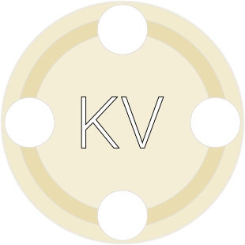

# API-KV: Simple and Flexible Key-Value Storage



Welcome to API-KV, a user-friendly and versatile Key-Value storage designed with simplicity and API-first in mind.
Powered by SQLite and implemented in Golang, API-KV offers an effortless experience for managing your data.

Features:

- **Easy to Use**: With API-KV, you can get started in no time. Simply download the binary and run it, and you're good
  to go. No complicated setup required!
- **Flexible Storage**: API-KV leverages the power of SQLite to provide a reliable and efficient storage solution for
  your key-value data.
- **Pre-built Docker Containers**: We have pre-built Docker containers available, making it even easier to deploy API-KV
  in your preferred environment.
- **Unbound experience**: Say goodbye to RAM limitations and the complexities of embedded DB-Per-App. API-KV, allows you
  to store everything on disk while maintaining efficient indexing and automatic removal of expired items.
- **Namespaces**: No more conflicts between apps or pre-defined databases. Organize keys in namespaces, which are
  dynamically created without restrictions.

Self-hosted friendly.

## Installation

- Via GitHub [releases](https://github.com/reddec/api-kv/releases/latest)
- Via Go install: `go install -v github.com/reddec/api-kv/cmd/...@latest`
- Via [Docker image](https://github.com/reddec/api-kv/pkgs/container/api-kv) (x64 and
  arm): `ghcr.io/reddec/api-kv:latest`

## Usage

- [OpenAPI spec](openapi.yaml)
- [Live docs](https://elements-demo.stoplight.io/?spec=https://raw.githubusercontent.com/reddec/api-kv/master/openapi.yaml)
- [](http://godoc.org/github.com/reddec/api-kv/api/client)
  generated Go API client

Basic rules of URL: `/<namespace>/<key>`, and content is value.

Create (or update) record

    curl -v -H 'X-Api-Key: changeme' --data-binary 'Hello world' http://127.0.0.1:8080/demo/key1

Create (or update) record with TTL (2 minutes)

    curl -v -H 'X-Api-Key: changeme' --data-binary 'Hello world' http://127.0.0.1:8080/demo/key1?ttl=120

Get record

    curl -v -H 'X-Api-Key: changeme' http://127.0.0.1:8080/demo/key1

Iterate over keys in namespace

    curl -v -H 'X-Api-Key: changeme' http://127.0.0.1:8080/demo

Delete record

    curl -v -X DELETE -H 'X-Api-Key: changeme' http://127.0.0.1:8080/demo/key1

Delete namespace

    curl -v -X DELETE -H 'X-Api-Key: changeme' http://127.0.0.1:8080/demo

### Go client

```go
// errors omitted for demonstration purpose
kv, _ := client.Dial("https://example.com", "my-app", "my-secret-token")

// set item
_ = kv.Set(ctx, "foo", []byte("bar"))
_ = kv.Set(ctx, "bar", []byte("baz"))

// set item with expiration
_ = kv.SetExpire(ctx, "alice", []byte("bob"), time.Minute)

// get item
value, _ := kv.Get(ctx, "foo")

// delete item
_ = kv.Delete(ctx, "foo")

// errors omitted for demonstration purpose
kv, _ := Dial("https://example.com", "my-app", "deadbeaf")

// iterate
it := kv.Keys()
for it.Next(ctx) {
    for _, key := range it.Keys() {
        fmt.Println(key)
    }
}

// check errors
if it.Error() != nil {
    panic(it.Error())
}

// destroy namespace
_ = kv.Destroy(ctx)
```

## Configuration

`api-kv serve`

```
Usage:
  api-kv [OPTIONS] serve [serve-OPTIONS]

Help Options:
  -h, --help                  Show this help message

[serve command options]
      -b, --bind=             API binding address (default: 127.0.0.1:8080) [$API_KV_BIND]
      -d, --dir=              Directory to store data (default: data) [$API_KV_DIR]
      -t, --token=            Authorization token (default: changeme) [$API_KV_TOKEN]
          --batch-size=       Batch size for keys iteration (default: 20) [$API_KV_BATCH_SIZE]
          --cleanup-interval= Cleanup interval for expired items (default: 1m) [$API_KV_CLEANUP_INTERVAL]
```

- For docker distribution:
    - the bind address is `0.0.0.0:8080`
    - the directory is `/data`

## Community and Contributions

We encourage you to join our community and contribute to API-KV's development. Whether it's reporting bugs, suggesting
features, or submitting pull requests, your input is highly valued. Together, we can make API-KV even better!

Join the conversation on our GitHub Discussions page and check out our contribution guidelines to get started.

## License

API-KV is open-source and released under the MIT License. Feel free to use, modify, and distribute it as per the terms
of the license.

We hope you enjoy using API-KV! If you have any questions or need assistance, don't hesitate to reach out. Happy coding!